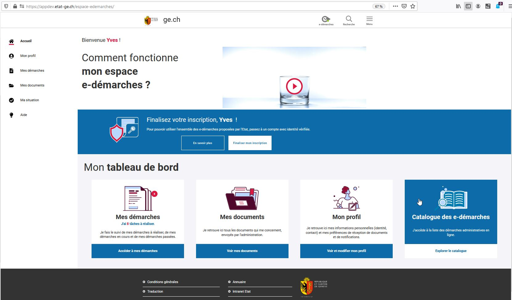

# L'espace numérique de l'usager

Comme l'Espace numérique de l'usager est un projet commun à l'État de Genève et à la
société luxembourgeoise Jway, il est hébergé sur une page spéciale de GitHub :
[voir ici](https://github.com/Espace-numerique-de-l-usager/enu-geneve).
